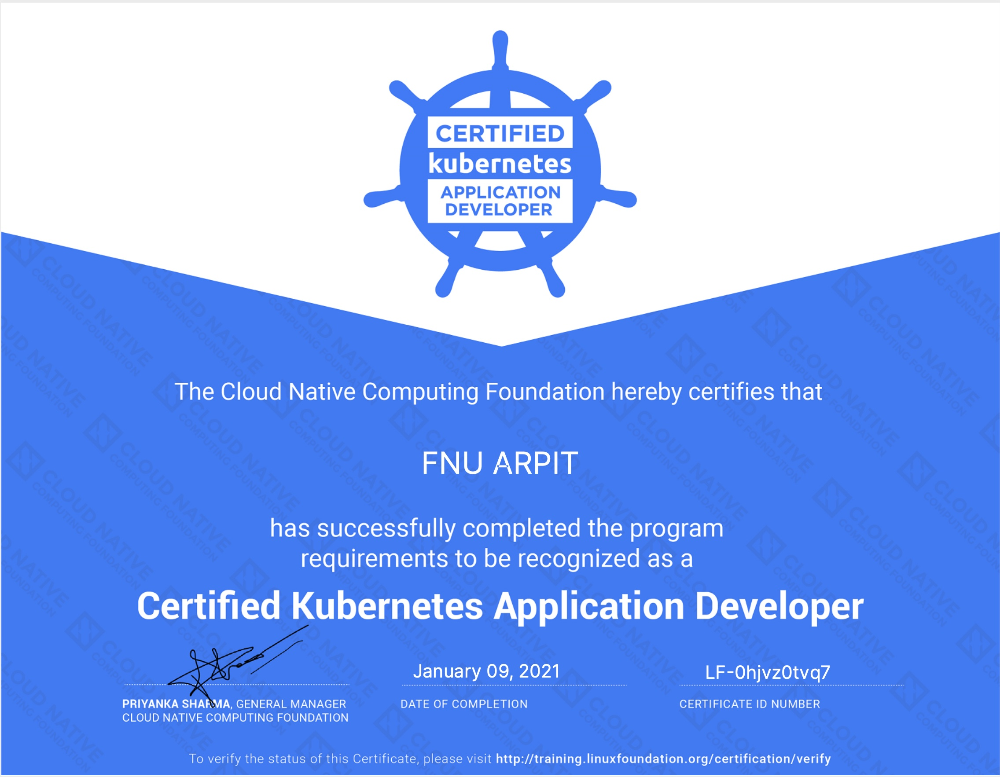
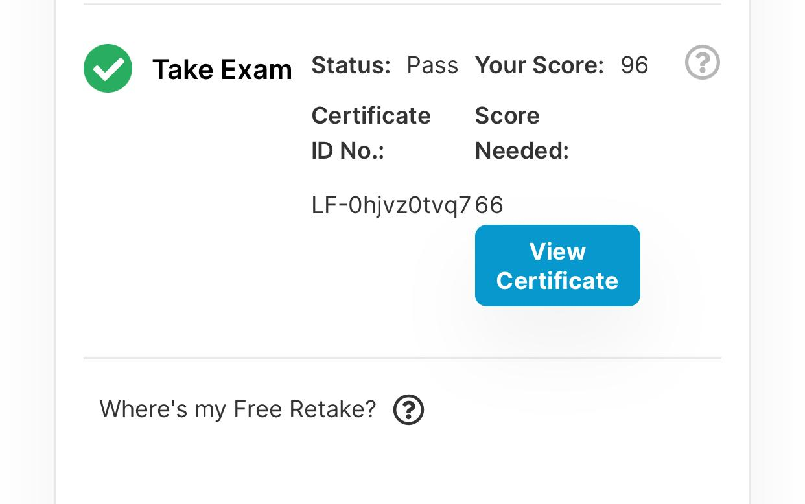

# Kubernetes Presentations

## CKAD Presentation

**What is the presentation about**

Inspiring others to learn kubernetes in a fun way

 

---
## Introduction to Kubernetes

**What is the presentation about**

As part of the SAP Docker Training, added a simple introduction towards Kubernetes and an attempt to deflate the fear of K8S complexity. 

Also an attempt to provide direction towards the online resources with self-paced training as there are many ways to skin the cat (aka learn things)

---

